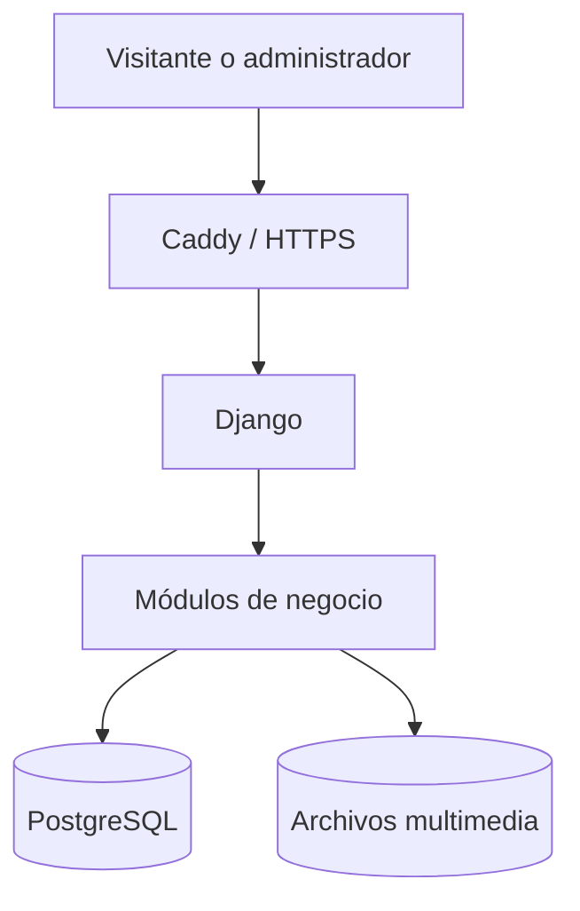

# Arquitectura

## Objetivos

La arquitectura responde a los requerimientos RF-01 a RF-25 y RNF-01 a RNF-17 del documento del proyecto. Prioriza seguridad, bajo costo, facilidad de despliegue y una curva de mantenimiento razonable para un equipo de cuatro integrantes.

## Capas

| Capa | Contenido | Regla |
| --- | --- | --- |
| Presentacion | Templates, CSS, formularios | No accede directamente a la base de datos |
| Aplicacion | Vistas, formularios, servicios | Orquesta casos de uso y permisos |
| Dominio | Modelos y reglas | Conserva invariantes y estados validos |
| Infraestructura | PostgreSQL, almacenamiento, correo, proxy | Se configura por variables de entorno |

## Limites modulares

- `accounts` es propietario de usuarios, roles y permisos.
- `events` es propietario del calendario y eventos.
- `news` es propietario de anuncios, borradores y publicaciones.
- `gallery` es propietario de álbumes y metadatos de imagen.
- `contacts` es propietario del ciclo de vida de mensajes.
- `core` contiene configuración transversal e institucional, sin convertirse en un deposito de logica.

Las dependencias deben apuntar a interfaces o modelos propietarios. No se permite importar vistas de otro modulo ni crear consultas duplicadas sobre tablas ajenas.

## Ambientes

| Ambiente | Configuración | Propósito |
| --- | --- | --- |
| Local | `config.settings.local` | Desarrollo con recarga y correo en consola |
| Pruebas | `config.settings.test` | Pruebas aisladas y rapidas |
| Produccion | `config.settings.production` | HTTPS, cookies seguras, HSTS y errores controlados |

## Escalabilidad

El primer despliegue puede usar un solo servidor con Caddy, Django y PostgreSQL. Si crece el trafico, el contenedor web puede replicarse y la base de datos y archivos pueden moverse a servicios gestionados sin reescribir los módulos. Redis, tareas en segundo plano o una API separada solo se agregaran cuando exista un caso de uso medido.

